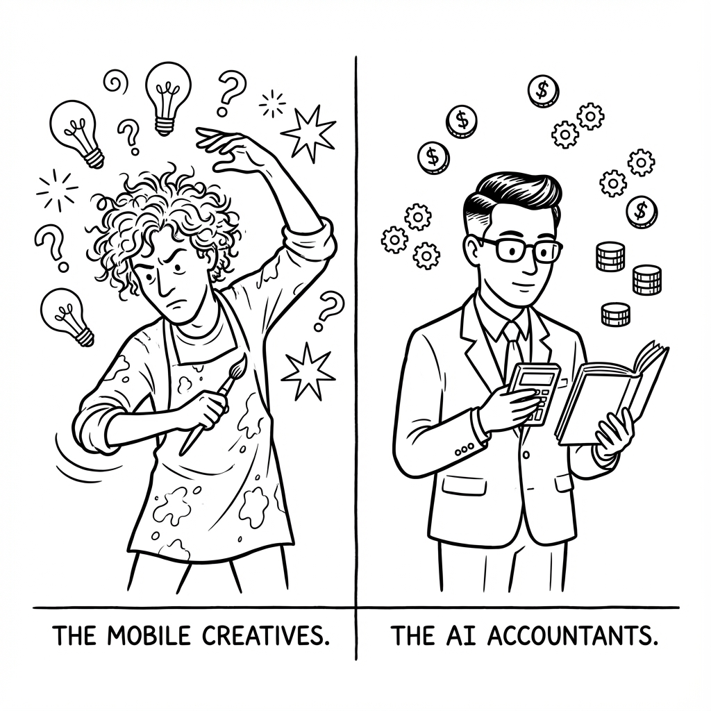

 ，# Manus首席科学家访谈启发 | 口播脚本

---

这应该是我今年看过最有价值的一场 中文AI访谈

看完Manus首席科学家季逸超和张小珺的这场对谈，我的脑子里只有上面这句话

不管你是做AI的、用AI的、还是对AI感兴趣的普通人，都建议去看一下

每个人一定会有不一样的启发
我总结了几个对我自己的启发
接下来我会逐个展开

---

第一个

移动互联网喜欢艺术家，AI时代需要经营者

季逸超说了一句话，特别扎心

「太多人有乔布斯的病，却没有乔布斯的命」

什么意思呢？

移动互联网时代，边际成本几乎是零，当你的软件/产品，有了规模之后，你的服务成本基本不变

你可以很情怀、很偏执、很艺术家

只要能找到一群跟你共振的用户，你就能把这个事业做起来

但AI不一样

AI创业更像传统制造业

每一次用户调用 都一定会产生token成本

用的人越多，成本越高

所以AI时代，你不能只会做产品

你还得会算账

---

第二个

AI时代，不做什么比做什么更重要

这是我从访谈里获得的最大启发之一

AI时代有一个诡异的现象

**【画面：数字特效「10x」】**

产能被放大了10倍，最近一人公司的概念也很火热

以前做一个新功能，可能要排期3个月

现在一个人加AI，可能一周就做出来了

产能大了，机会看起来也多了

每天都有新的方向在诱惑你

但季逸超说了一句话

「以前可能没有'思考不做什么'的奢侈。现在'不做什么'才是每天要回答的命题。」

Manus到现在也是一款相对克制的产品

很多Agent公司拼命给AI加工具、加能力

Manus反而每个月都在想——能删掉什么？

他们甚至砍掉了一个做了7个月的AI浏览器项目

理由只有一个

做完之后，自己都觉得不太酷

如果你本该最喜欢这个产品的人，你都不喜欢

那用户怎么可能喜欢？

---

第三个

多做一步，交付价值就能翻倍

这是一个产品哲学层面的启发

世界上有很多能做网页的AI

但Manus能做完网页之后

再自己用浏览器把网页玩一遍，看看有没有bug

再分析一下流量数据

再生成一个PPT发给投资人

这种「交付感」

才是用户愿意付费的原因

解决好最后一公里，交付价值就能翻倍

这不只是Agent的逻辑

更是所有产品和服务的底层哲学

---

第四个

模型不是人，别用人的分工逻辑设计Agent

很多人设计多Agent系统的时候

喜欢套人类的分工方式

一个Agent是设计师，一个是程序员，一个是产品经理

季逸超说，这是错的

为什么人类社会需要分工？

因为我们每个人都不全能

知识面、脑力带宽都有限

但模型不一样

模型比人全能得多

它既能写代码，又能做设计，还能分析数据

你硬要套人类的分工模式

反而引入了大量不必要沟通损耗

所以，对外可以把Agent人格化

让用户更容易理解

但在设计系统时，不能按人的逻辑来

把Agent人格化，某种程度上是人类的一种自恋

---

第五个

垂直Agent应该服务「有需求但做不了」的人

这一点对我做穿搭Agent非常有启发

季逸超举了一个例子

如果你要做一个剪辑Agent，给剪辑师用

那会非常难

因为专业人士会用极高的标准来审视你

你但凡一个细节没处理好，就是严重扣分

他是从风险控制的角度在看你

但如果你做的是「给有剪辑需求但不会剪辑的人」用的产品

用户不知道专业应该是什么样

他只会为你每一个帮到他的点加分

垂直Agent应该服务的

是有需求但做不了的人

而不是已经会做的专家

---

第六个

AI接下来的进步，需要用户的参与

这是访谈中，季逸超说的最后一句话

主持人问季逸超，基于你当下的认知，下一个关键的下注点是什么
他回答 AI接下来的进步，需要用户的参与

在Agent这种长链路的场景下

用户的使用轨迹和反馈是最关键的数据

用户不只是打个5分或1分

用户会「教」Agent

也会「修」Agent的错误

但更重要的是

这意味着，AI浪潮跟每一个普通人都有关

我们每个人都是AI的用户

我们用它、教它、修正它的过程

就是在参与AI进步的过程

这不是一个只属于技术人员的时代

这是一个每个人都能参与、都能受益、都能产生影响的时代

---

## 【结尾 CTA】

**【画面：切回讲者】**

如果只能从这篇访谈里带走一个启发

我选这个

AI时代的竞争，「有所不为」变得极度重要

大家的时间精力是一样的

我们要考虑清楚，把自己的时间押注在什么事情上

产能被放大了，机会看起来多了

但真正稀缺的是冷静

知道什么该做，什么不该碰

这才是这个时代最需要的能力

---

**【总字数：约1150字，符合口播800-1200字要求】**
