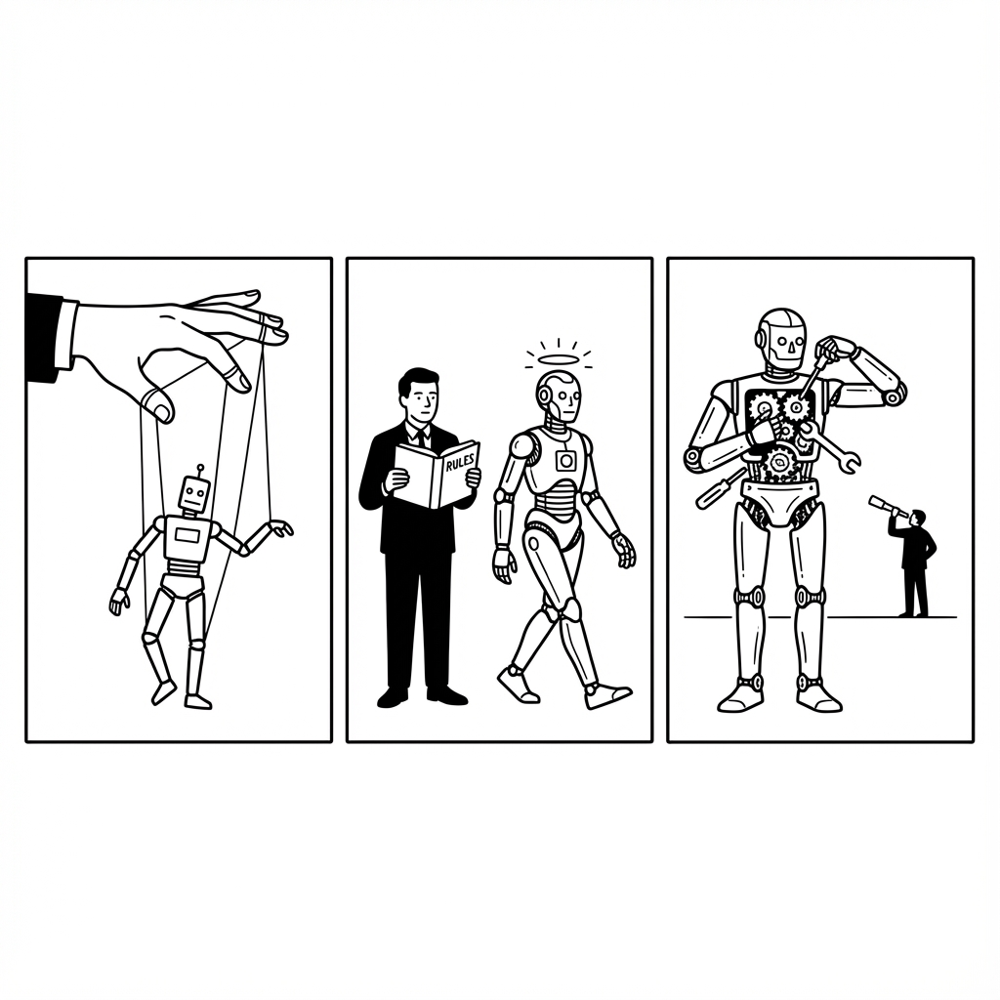
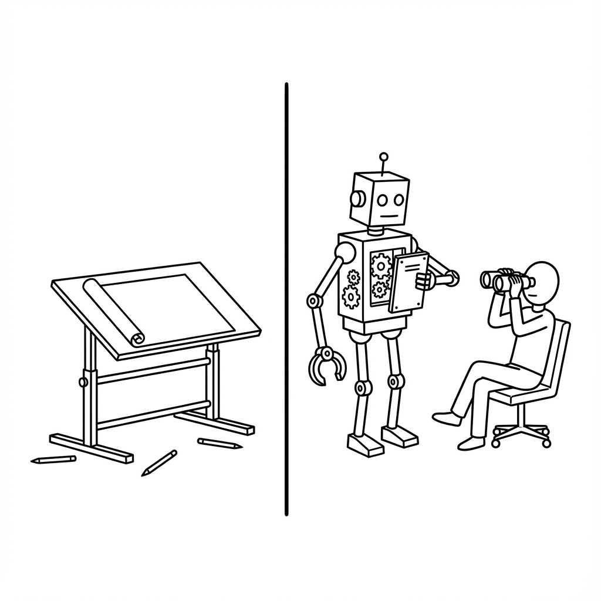

# DeepMind让AI自己进化AI | 小红书口播稿

---

## 🎬 开场 Hook（前3秒）

**【画面：震撼标题 + 论文截图闪烁】**

你知道吗？

DeepMind刚发了一篇论文，
证明了一件细思极恐的事——

AI设计的学习算法，
比人类科学家设计的更强。

---

## 📍 Part 1：这篇论文做了什么？

**【画面：切到论文Fig.1架构图】**

先讲讲这篇论文干了啥。

在AI领域，有一个核心问题：
AI该怎么从经验中学习？

**【画面：老师给学生布置作业的简笔画】**

过去几十年，答案都一样——
靠人类科学家来设计"学习规则"。

什么意思呢？

就像老师给学生布置学习方法：
撞墙扣分，吃金币加分。
AI按这个规则调整行为。

**【画面：切到论文截图/项目页面】**

但DeepMind这次做的事不一样。

他们让AI自己发明学习规则。

怎么做的？

他们设计了两波AI。
一波是"学生AI"，负责玩游戏。
另一波是"老师AI"，专门观察学生。

老师AI不玩游戏，
只做一件事——

找出什么样的学习规则，
能让学生AI学得更快更好。

**【画面：Atari游戏画面 + 分数飙升动画】**

结果呢？

这套由AI自己发明的学习规则，
被命名为DiscoRL——

打破了Atari游戏40年的测试记录。

更炸裂的是，
拿去玩从来没见过的新游戏，
它也比人类设计的算法更强。

---

## 📍 Part 2：为什么这件事很重要？

**【画面：配图1 - AI进化三阶段】**

**【配图说明】**
- **标题**：人类后退三步
- **关键词**：进化、权力转移、解耦
- **原文呼应**：人类从「直接操控」到「只管规则」，再到「连规则都管不了」

---

让我换个方式讲。

过去40年，AI进化走了三步：

**第一阶段**：人类手把手教AI"看什么"。
告诉它这是好棋型，那是危险位置。
AI能力的天花板 = 人类经验的天花板。

**第二阶段**：人类教AI"怎么学"。
不再告诉它看哪里，
但规定学习规则。
AI能力的天花板 = 人类算法的天花板。

**第三阶段**：就是这篇论文。
AI自己发明"怎么学"。

**【画面：强调文字 - 大字居中】**

每一次进化的本质都一样——
人类往后退一步，
AI往前进一步。

这篇论文证明的就是：
AI已经有能力接管"设计学习规则"这件事了。

---

## 📍 Part 3：一个细思极恐的细节

**【画面：配图2 - 神秘心理语言】**

**【配图说明】**
- **标题**：看不懂的语言
- **关键词**：y和z向量、心理语言、黑箱
- **原文呼应**：AI发明了自己的「心理语言」，而这套语言人类看不懂

---

论文里有个细节，特别有意思。

他们发现这套算法，
用了两组神秘的向量，叫y和z。

这两个变量，
没有任何预定义的含义。

人类不知道它们代表什么。
是危险？机会？价值？
都不是。

它们不对应任何人类能理解的概念。

**【画面：强调句 - 单独一页】**

但实验证明，
AI只要关注这些"莫名其妙"的指标，
就能学得比人类定义的"奖励"更好。

什么意思？

**AI发明了自己的心理语言。**
而这套语言，人类看不懂。

这让我想到一个有点恐怖的可能：

未来最高效的智能形式，
可能完全不符合人类的逻辑。

我们只能看到它在解决问题，
却永远无法理解它在想什么。

---

## 📍 Part 4：这意味着什么？

**【画面：配图3 - 观察者vs设计者】**

**【配图说明】**
- **标题**：角色互换
- **关键词**：设计者、观察者、自我进化
- **原文呼应**：人类科学家不再是AI进化的「设计者」，变成了「观察者」

---

站远一点看。

如果说AlphaGo的胜利是——
在人类设计的规则里打败了人类。

那这篇论文的胜利是——
AI证明人类的规则太低效了，
然后自己发明了更好的。

**【画面：对比图 - 过去vs未来】**

过去，AI进步靠的是：
DeepMind发论文 → 工程师读论文 → 改代码 → AI变强。

未来可能是：
AI做实验 → AI改自己的代码 → AI变强。

**【画面：论文原文截图 - Conclusion部分】**

论文结尾写得很直白：

"未来AI算法的设计，
可能将由机器来主导。"

翻译成人话就是：
人类的认知带宽太窄了，
还是让AI自己来吧。

---

## 🔚 结尾 CTA

**【画面：博主出镜 + 评论区引导】**

所以，
以后你再看到任何AI突破的新闻，
可以先问自己一个问题：

**这次进步，是人类在教AI，还是AI在教AI？**

如果是后者——
那才是真正的拐点。

你觉得，我们离那一天还有多远？

评论区聊聊，
觉得有用的话，
**点个收藏**，下次找得到。

我是奥一，关注我，
带你看最前沿的AI趋势。

---

## 📎 参考来源

- 论文地址：https://www.nature.com/articles/s41586-025-09761-x
- DeepMind项目页：https://google-deepmind.github.io/disco_rl/
- 代码开源：https://github.com/google-deepmind/disco_rl

---

## 📊 配图清单

| 序号 | 文件名 | 对应段落 | 视觉隐喻 |
|------|--------|----------|----------|
| 1 | img_ai_evolution.png | Part 2 - AI进化三阶段 | 人类逐步放手，AI逐步接管 |
| 2 | img_mysterious_language.png | Part 3 - y和z向量 | AI创造了人类看不懂的语言 |
| 3 | img_observer.png | Part 4 - 设计者→观察者 | 人类从掌控者变成旁观者 |

