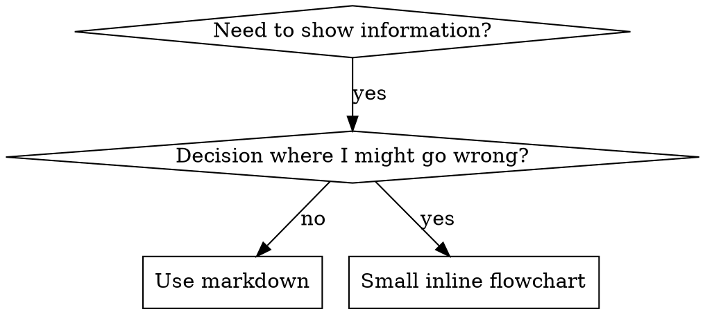

# 会话记录 2026-02-26

**时间段**：03:03 — 03:43
**消息数**：23 条（10 用户 / 13 AI）

---

**03:03** **奥一**

我刚刚和朋友聊天 聊到了思考的快与慢 发现人主要靠系统一来生活 很少到系统 2 ,但是如果用到了系统二是不是会让人印象更深? 比如我的挂点激活了用户的系统 2  他是不是会对我更感兴趣,更信任?我不太确定

---

**03:04** **CC**

你的直觉方向是对的，但框架有个漏洞。

**你混淆了三件事：**

1. 激活系统 2
2. 留下深刻印象
3. 建立信任

这三个不是同一条链路。

---

**系统 2 激活 ≠ 正面印象**

系统 2 被触发的场景很多：
- 看到矛盾 → 怀疑
- 遇到困难 → 放弃
- 解开谜题 → 愉悦
- 被反驳 → 防御

"用户启动了系统 2"这件事本身是中性的。**方向才是关键。**

---

**真正有效的机制是"顿悟时刻"**

你说的"挂点激活系统 2"，有效的那种是：
> 用户原本用系统 1 运行一个假设 → 你的内容让他停下来重新审视 → 他得出新结论 → **"原来如此"的释放感**

这个释放感才是信任感的来源，不是系统 2 本身。

认知科学上叫 **insight experience（顿悟体验）**，它同时满足：
- 消耗了认知努力（系统 2 参与）
- 有清晰的结果（不是困惑）

---

**另一个被你忽视的方向：信任主要靠系统 1**

信任感大部分是 **"这个人感觉可靠/熟悉/一致"**——这是纯系统 1 的判断。

如果你的内容让人每次都要费劲思考，他可能会觉得你"深刻"，但不一定觉得你"亲近"或"可信"。

---

**所以更精准的模型是：**

```
挂点的最佳效果 = 触发系统 2（轻度摩擦）+ 快速导向顿悟 + 释放感
```

而不是"越难懂越好"或"越让人思考越好"。

---

**你真正要问的问题是：**
你的挂点，是在制造**困惑**，还是在制造**顿悟**？这两者都让人停下来，但结果完全相反。

---

**03:08** **奥一**

ok 其实我真正在考虑的是 我了解到这个大脑的机制之后，我是不是可以在自媒体创作的时候去利用好这个机制，开头标题封面去吸引用户 然后设计文稿和逐字稿的节奏安排 让人有获得感 想看完我的内容

---

**03:09** **CC**

这个方向是对的，但你现在在用理论框架思考，还没到执行层。让我帮你拆实了。

---

**你真正要设计的是一个循环，不是一次性激活**

```
好奇缺口 → 轻微摩擦 → 顿悟释放 → 下一个好奇缺口
```

这个循环贯穿整个内容，不只是开头。

---

**三个位置，三种不同机制：**

**① 标题/封面 → 纯系统 1，不要让人思考**

目标：触发"我要点进去"的冲动，0.3秒内完成。

有效的是：
- 身份共鸣："做自媒体的人看这个"
- 好奇缺口："我以为A，结果是B"
- 具体利益："学完这个少走3年弯路"

❌ 你不需要在这里激活系统 2，你需要绕过它。让人在没想清楚之前就点进来。

---

**② 开头前30秒/前100字 → 锁定承诺**

目标：让用户觉得"来对了"。

具体做法：**先给结论，再给过程。**
不是"今天我要告诉你……"
而是"大多数人写开头的方式是错的，错在——"

这里才开始轻度激活系统 2：让他觉得自己原来的认知可能有问题。

---

**③ 中间节奏 → 设计"顿悟密度"**

这是你说的"获得感"的核心。

每隔一段要有一次小释放：
- 反常识翻转："你以为X，其实Y"
- 具体化一个抽象概念
- 给一个可以立刻复用的动作

**获得感 = 顿悟次数 × 顿悟质量 ÷ 消耗时间**

节奏太慢，中间没有释放点，用户会划走。

---

**你真正缺的不是理论，是一个问题：**

你现在做的内容，**每500字/每1分钟，有几次小顿悟？**

如果你扫一遍自己的稿子，说不出来在哪里，那就是获得感不够的根本原因——不是系统 1/2 的问题，是顿悟密度不够。

---

你现在在做哪种形式的内容？视频还是图文？这会影响节奏设计的具体方式。

---

**03:12** **奥一**

ok 想把这种思想和价值观 做一个skill 
我在写完一稿稿荐之后，它会被智能触发，然后用这套方法论来审稿 给我提出一些调整建议 外挂一个审查官

然后 这个功能是不是不需要知道我的写稿思路，他可以另起一个 上下文窗口 那是不是 subagent 更合适?

---

**03:13** **CC**

你的判断基本对，但有几个概念需要分清。

---

**智能触发 ≠ Skill**

- **Skill**：手动调用，`/审稿` 这样触发
- **Hook**：自动触发，比如你保存某个文件后自动执行

如果你要"写完就自动审"，那是 Hook（PostToolUse/Stop hook），不是 Skill。  
如果你要"写完手动叫它来审"，那是 Skill。

你说的"智能触发"，先确认一下——是自动还是手动？

---

**Subagent 的判断你是对的**

审稿官不需要知道你们聊了什么，只需要：
1. 稿子本体
2. 审稿方法论（嵌在 prompt 里）
3. 你的写作偏好（从 `5-Identity/PROFILE.md` 读）

所以：
- **干净的上下文** → 用 Task tool 起一个 subagent ✓
- 方法论直接写进 subagent 的 prompt
- 不带当前对话上下文，不噪音

---

**建议的架构：**

```
Skill: /审稿
  ↓
读取草稿文件路径
  ↓
Task tool → subagent
  prompt 里包含：
  - 系统1/2 方法论
  - 好奇缺口检查
  - 顿悟密度检查  
  - 开头锁定承诺检查
  读取：5-Identity/PROFILE.md（你的风格偏好）
  ↓
输出：带行号的具体修改建议
```

---

**一个你没想到的问题：**

审稿的标准从哪来？方法论我们刚聊了一半，还没有完整的检查清单。

你是要我们现在把这套标准先定义完整，再写 Skill？还是先做一个粗版，边用边迭代？

---

**03:20** **奥一**

先把标准梳理清楚吧
然后 写作系统里面的 '/Users/xiazhedan/Documents/obsidendata/AoYiSecond-cc-light/2-Areas/WritingSystem/CORE.md' 和'/Users/xiazhedan/Documents/obsidendata/AoYiSecond-cc-light/2-Areas/WritingSystem/WriteRule' 应该也有助于补充细节 
先有大框架 然后填上细节 给我一份审查的初稿吧

---

**03:20** **CC**

关键的规则文件先读一下。

---

**03:21** **CC**

材料够了，现在综合梳理。

---

**03:22** **CC**

材料读完了。综合 CORE.md、WriteRule 全套规则，加上我们讨论的系统1/2框架，给你梳理出审查标准初稿：

---

## 稿件审查官标准 v0.1

### 审查哲学

核心公式：**获得感 = 顿悟次数 × 顿悟质量 ÷ 消耗时间**

底层回路：心理缺口 → 人性坡 → 小顿悟循环 → 行动锚

审查官的任务：不是挑毛病，是找出「哪里漏气了」，给出可执行的修改方向。

---

### D1 入口层：标题 / 封面
**目标**：0.3秒内绕过系统2，让人在没想清楚之前就点进来

- 标题是否命中4个滤镜之一（冲突 / 情绪 / 效率数据 / 阶层身份）
- 是否避免了"总结式标题"（只概括内容，没有爆点张力）
- 封面文案是否短于10字且有独立冲击力（双标题时）
- 单标题是否"一句顶两句"（同时完成拦路 + 指路）

---

### D2 锁定层：开头
**目标**：3秒完成三件事：制造缺口、建立价值预期、埋下角色暗线

- 前10个字能否让人停下来？
- 是否命中了18种开头中的某一种（有明确钩子类型）
- 是否埋了"角色 + 议题暗线"（读者隐约知道你站在谁这边，这不是小事）
- 价值承诺是否具体可感（"看完你能..." 不是 "今天给大家分享..."）
- ❌ 是否存在自嗨式开头 → 尝试删掉第一段，看第二段是不是更好的开头
- 开头能否自然过渡到正文（没有断层感）

---

### D3 体验层：内容节奏
**目标**：维持「缺口 → 轻摩擦 → 顿悟释放 → 下一个缺口」的循环

**顿悟密度**
- 每500字是否至少有1次小释放（反常识翻转 / 将抽象变具体 / 立即可复用的动作）
- 是否存在"顿悟沙漠"（大段铺垫没有任何释放点）

**认知重构**
- 是否有旧地图被翻新的时刻（读者原来的认知被动摇）
- 翻新后是否给了新地图（不能只破，要给新框架）

**理性轴（信息加工成本）**
- 结构是否清晰但不学术（隐形结构，自然过渡）
- 是否做到一句一信息（没有把两件事塞进一句）
- 有无可删掉的废话段

**感性轴（情绪能量）**
- 是否触发了高唤醒情绪（好奇 / 愤怒 / 敬畏 / 兴奋，而不是满足 / 悲伤）
- 是否有颗粒度极细的场景细节（激活情景记忆而不是泛泛而谈）

---

### D4 质感层：风格与语言
**目标**：内核极硬，外壳极软——想法像论文，文字像朋友发微信

**句式**
- 句子是否偏短？是否多换行？
- ❌ 是否出现了"不是...而是..."句式（奥一禁用）
- ❌ 是否用了加粗而不是「」符号

**语言**
- 是否口语化但不幼稚（不卖萌、不教条、不说教）
- ❌ 是否有空洞形容词（"非常重要""极其关键"）
- 英文/术语是否点到为止（不大段英文，不炫技）

**立场**
- 是否有"有观点的观察者"气质（不中立科普、不和稀泥）
- 是否锋利但不戾气（可以扎心，不羞辱读者）
- 是否有"代表某类人声音"的潜台词（不直接点明）

**Cunningham钩子（高阶可选）**
- 是否在非核心区域有一个"主观暴论"或"良性漏洞"，能激发评论区讨论

---

### D5 转化层：结尾 / TakeAways
**目标**：在读者脑子里安一个"以后会被想起的锚"

**TakeAways**
- 是否选定了锚的类型（记忆锚 / 行为锚 / 视角锚）
- 锚是否单独截图也成立（有传播价值）
- 是否用了邀请式语气（"可以先..." 而不是"你必须..."）

**互动引导**
- ❌ 是否用了封闭式结尾（"综上所述""希望大家..."）
- 是否转化成了填空题或选择题（给读者具体的评论抓手）

**整体完形感**
- 读完是否有"来得值"的感觉（信息增量 vs 时间消耗）
- 是否有"下一篇我也想看"的预期

---

### 审查输出格式

```
【整体诊断】
一句话说清楚：这篇稿子目前主要在哪个层漏气

【D1 入口层】✅通过 / ⚠️可优化 / ❌需修改
问题：...
建议：...

【D2 锁定层】...
【D3 体验层】...
【D4 质感层】...
【D5 转化层】...

【优先修改3条】（按影响力排序）
1. [位置] 问题 → 修改思路
2. ...
3. ...
```

---

**这份初稿有几个地方需要你确认：**

1. **D3"每500字1次顿悟"** 这个频率你觉得合适吗？对你目前写的内容类型来说会不会太密？
2. **D5互动引导** 你的公众号定位说不刻意加传播钩子，但小红书/抖音需要——这个标准是通用的，还是要区分平台？
3. **Cunningham钩子** 这个你用得多吗？是列为"必查"还是"可选"？

---

**03:25** **奥一**

你的这些评判标准要有专业的信息来源,比如   - 每500字是否至少有1次小释放（反常识翻转 / 将抽象变具体 / 立即可复用的动作） 
为什么是 500 字 是你随便想的 还是有专业支撑的 ,如果缺乏支撑则需要找到对应支撑,你解释给我就好了,不需要把这些解释落到文档里

---

**03:25** **CC**

你问得很对，我直接承认：**"500字"是我拍脑袋的，没有专业支撑。**

---

**哪些是有依据的：**

"顿悟时刻能增强记忆"这个底层逻辑是真的。
Jung-Beeman 等人 2004 年在 *PLoS Biology* 的研究（神经科学，EEG+fMRI）发现：insight 瞬间会触发右颞叶的 gamma 波爆发，这种激活模式与更强的记忆编码相关。也就是说——顿悟时刻让人记得更牢，有神经科学支撑。

"高唤醒情绪推动传播"也是有据可查的。
Jonah Berger 在《疯传》背后的原始研究（发表于 *Journal of Marketing Research* 2012）分析了纽约时报 7000 篇文章的分享数据，结论：愤怒、敬畏、焦虑等高唤醒情绪显著正向预测分享率；悲伤（低唤醒）反而负向预测。

---

**哪些是没有依据的：**

"500字1次释放"——没有文献支持这个数字。

最近的文字阅读注意力研究非常少，现有的注意力数据大多来自视频（YouTube 发现每 2-3 分钟没有钩子用户流失明显），但视频和图文的注意力机制不同，不能直接套用。

---

**更诚实的替代方案：**

与其规定"每X字"，不如改成结构性标准：
**每个逻辑单元（一个论点/一个小节）至少有一次具体化或释放**——这和认知负荷理论（Sweller 1988）的"分块处理"原则对齐，也和你自己已有的"一句一信息点"逻辑一致，不需要假装有字数研究。

要不要顺着这个思路把 D3 那条标准改掉？

---

**03:31** **奥一**

可以 改掉吧 
然后记住 如果我要做这些长期服用的工具的时候  你给我的方法论设计的时候 要有相关的专业信息源 告诉我 我才能判断你做的是否准确
或者说 有些时效性很强的技能或者 专业性很强的技能和工具 的时候,你在设计的时候 就应该模仿正规的研究路径  先去搜集信息 专业源 然后判断整合 然后在沉淀

当做一件没这么熟的任务的时候 也是如此

---

**03:32** **CC**

收到，两件事同步做。

---

**03:33** **CC**

**D3 修改如下：**

原来（无依据）：
> 每500字是否至少有1次小释放

改为（结构性标准，有依据）：
> 每个独立论点/小节，是否有至少一次具体化或释放——抽象论点落地为场景/数据/可执行动作

依据：
- **Sweller 认知负荷理论（1988）**：信息必须分块处理，每块有清晰边界；论点是自然的分块单位，而不是字数
- **Jung-Beeman et al. (2004, *PLoS Biology*)**：顿悟时刻增强记忆编码——所以每个论点要有释放点，不是为了"显得活泼"，是为了让读者记住

---

**关于你说的那条原则，已存入 candidates.md。**

简单说：你在要求我做"research-backed design"而不是"vibes-based design"。这条原则我理解，下次 /digest 时你可以把它晋升为操作规则，后续所有工具设计都会受约束。

---

还有一个问题：这份审查标准目前只在对话里，还没有落到文件。你想现在保存到 WriteRule 目录下，还是等我们把剩余几条标准也核实完之后再统一保存？

---

**03:35** **奥一**

落到文件里吧

---

**03:36** **CC**

已保存到 `WriteRule/稿件审查标准.md`，L2 成员清单同步更新。

文件底部加了一条透明说明：标注了哪些条目有文献支撑、哪些还是实践共识待补，方便你后续知道哪里还需要核实。

下一步是写 skill 吗？

---

**03:39** **奥一**

挺好的 形成 skill 吧

---

**03:39** **奥一**

Base directory for this skill: /Users/xiazhedan/.claude/skills/writing-skills

# Writing Skills

## Overview

**Writing skills IS Test-Driven Development applied to process documentation.**

**Personal skills live in agent-specific directories (`~/.claude/skills` for Claude Code, `~/.codex/skills` for Codex)** 

You write test cases (pressure scenarios with subagents), watch them fail (baseline behavior), write the skill (documentation), watch tests pass (agents comply), and refactor (close loopholes).

**Core principle:** If you didn't watch an agent fail without the skill, you don't know if the skill teaches the right thing.

**REQUIRED BACKGROUND:** You MUST understand superpowers:test-driven-development before using this skill. That skill defines the fundamental RED-GREEN-REFACTOR cycle. This skill adapts TDD to documentation.

**Official guidance:** For Anthropic's official skill authoring best practices, see anthropic-best-practices.md. This document provides additional patterns and guidelines that complement the TDD-focused approach in this skill.

## What is a Skill?

A **skill** is a reference guide for proven techniques, patterns, or tools. Skills help future Claude instances find and apply effective approaches.

**Skills are:** Reusable techniques, patterns, tools, reference guides

**Skills are NOT:** Narratives about how you solved a problem once

## TDD Mapping for Skills

| TDD Concept | Skill Creation |
|-------------|----------------|
| **Test case** | Pressure scenario with subagent |
| **Production code** | Skill document (SKILL.md) |
| **Test fails (RED)** | Agent violates rule without skill (baseline) |
| **Test passes (GREEN)** | Agent complies with skill present |
| **Refactor** | Close loopholes while maintaining compliance |
| **Write test first** | Run baseline scenario BEFORE writing skill |
| **Watch it fail** | Document exact rationalizations agent uses |
| **Minimal code** | Write skill addressing those specific violations |
| **Watch it pass** | Verify agent now complies |
| **Refactor cycle** | Find new rationalizations → plug → re-verify |

The entire skill creation process follows RED-GREEN-REFACTOR.

## When to Create a Skill

**Create when:**
- Technique wasn't intuitively obvious to you
- You'd reference this again across projects
- Pattern applies broadly (not project-specific)
- Others would benefit

**Don't create for:**
- One-off solutions
- Standard practices well-documented elsewhere
- Project-specific conventions (put in CLAUDE.md)
- Mechanical constraints (if it's enforceable with regex/validation, automate it—save documentation for judgment calls)

## Skill Types

### Technique
Concrete method with steps to follow (condition-based-waiting, root-cause-tracing)

### Pattern
Way of thinking about problems (flatten-with-flags, test-invariants)

### Reference
API docs, syntax guides, tool documentation (office docs)

## Directory Structure


```
skills/
  skill-name/
    SKILL.md              # Main reference (required)
    supporting-file.*     # Only if needed
```

**Flat namespace** - all skills in one searchable namespace

**Separate files for:**
1. **Heavy reference** (100+ lines) - API docs, comprehensive syntax
2. **Reusable tools** - Scripts, utilities, templates

**Keep inline:**
- Principles and concepts
- Code patterns (< 50 lines)
- Everything else

## SKILL.md Structure

**Frontmatter (YAML):**
- Only two fields supported: `name` and `description`
- Max 1024 characters total
- `name`: Use letters, numbers, and hyphens only (no parentheses, special chars)
- `description`: Third-person, describes ONLY when to use (NOT what it does)
  - Start with "Use when..." to focus on triggering conditions
  - Include specific symptoms, situations, and contexts
  - **NEVER summarize the skill's process or workflow** (see CSO section for why)
  - Keep under 500 characters if possible

```markdown
---
name: Skill-Name-With-Hyphens
description: Use when [specific triggering conditions and symptoms]
---

# Skill Name

## Overview
What is this? Core principle in 1-2 sentences.

## When to Use
[Small inline flowchart IF decision non-obvious]

Bullet list with SYMPTOMS and use cases
When NOT to use

## Core Pattern (for techniques/patterns)
Before/after code comparison

## Quick Reference
Table or bullets for scanning common operations

## Implementation
Inline code for simple patterns
Link to file for heavy reference or reusable tools

## Common Mistakes
What goes wrong + fixes

## Real-World Impact (optional)
Concrete results
```


## Claude Search Optimization (CSO)

**Critical for discovery:** Future Claude needs to FIND your skill

### 1. Rich Description Field

**Purpose:** Claude reads description to decide which skills to load for a given task. Make it answer: "Should I read this skill right now?"

**Format:** Start with "Use when..." to focus on triggering conditions

**CRITICAL: Description = When to Use, NOT What the Skill Does**

The description should ONLY describe triggering conditions. Do NOT summarize the skill's process or workflow in the description.

**Why this matters:** Testing revealed that when a description summarizes the skill's workflow, Claude may follow the description instead of reading the full skill content. A description saying "code review between tasks" caused Claude to do ONE review, even though the skill's flowchart clearly showed TWO reviews (spec compliance then code quality).

When the description was changed to just "Use when executing implementation plans with independent tasks" (no workflow summary), Claude correctly read the flowchart and followed the two-stage review process.

**The trap:** Descriptions that summarize workflow create a shortcut Claude will take. The skill body becomes documentation Claude skips.

```yaml
# ❌ BAD: Summarizes workflow - Claude may follow this instead of reading skill
description: Use when executing plans - dispatches subagent per task with code review between tasks

# ❌ BAD: Too much process detail
description: Use for TDD - write test first, watch it fail, write minimal code, refactor

# ✅ GOOD: Just triggering conditions, no workflow summary
description: Use when executing implementation plans with independent tasks in the current session

# ✅ GOOD: Triggering conditions only
description: Use when implementing any feature or bugfix, before writing implementation code
```

**Content:**
- Use concrete triggers, symptoms, and situations that signal this skill applies
- Describe the *problem* (race conditions, inconsistent behavior) not *language-specific symptoms* (setTimeout, sleep)
- Keep triggers technology-agnostic unless the skill itself is technology-specific
- If skill is technology-specific, make that explicit in the trigger
- Write in third person (injected into system prompt)
- **NEVER summarize the skill's process or workflow**

```yaml
# ❌ BAD: Too abstract, vague, doesn't include when to use
description: For async testing

# ❌ BAD: First person
description: I can help you with async tests when they're flaky

# ❌ BAD: Mentions technology but skill isn't specific to it
description: Use when tests use setTimeout/sleep and are flaky

# ✅ GOOD: Starts with "Use when", describes problem, no workflow
description: Use when tests have race conditions, timing dependencies, or pass/fail inconsistently

# ✅ GOOD: Technology-specific skill with explicit trigger
description: Use when using React Router and handling authentication redirects
```

### 2. Keyword Coverage

Use words Claude would search for:
- Error messages: "Hook timed out", "ENOTEMPTY", "race condition"
- Symptoms: "flaky", "hanging", "zombie", "pollution"
- Synonyms: "timeout/hang/freeze", "cleanup/teardown/afterEach"
- Tools: Actual commands, library names, file types

### 3. Descriptive Naming

**Use active voice, verb-first:**
- ✅ `creating-skills` not `skill-creation`
- ✅ `condition-based-waiting` not `async-test-helpers`

### 4. Token Efficiency (Critical)

**Problem:** getting-started and frequently-referenced skills load into EVERY conversation. Every token counts.

**Target word counts:**
- getting-started workflows: <150 words each
- Frequently-loaded skills: <200 words total
- Other skills: <500 words (still be concise)

**Techniques:**

**Move details to tool help:**
```bash
# ❌ BAD: Document all flags in SKILL.md
search-conversations supports --text, --both, --after DATE, --before DATE, --limit N

# ✅ GOOD: Reference --help
search-conversations supports multiple modes and filters. Run --help for details.
```

**Use cross-references:**
```markdown
# ❌ BAD: Repeat workflow details
When searching, dispatch subagent with template...
[20 lines of repeated instructions]

# ✅ GOOD: Reference other skill
Always use subagents (50-100x context savings). REQUIRED: Use [other-skill-name] for workflow.
```

**Compress examples:**
```markdown
# ❌ BAD: Verbose example (42 words)
your human partner: "How did we handle authentication errors in React Router before?"
You: I'll search past conversations for React Router authentication patterns.
[Dispatch subagent with search query: "React Router authentication error handling 401"]

# ✅ GOOD: Minimal example (20 words)
Partner: "How did we handle auth errors in React Router?"
You: Searching...
[Dispatch subagent → synthesis]
```

**Eliminate redundancy:**
- Don't repeat what's in cross-referenced skills
- Don't explain what's obvious from command
- Don't include multiple examples of same pattern

**Verification:**
```bash
wc -w skills/path/SKILL.md
# getting-started workflows: aim for <150 each
# Other frequently-loaded: aim for <200 total
```

**Name by what you DO or core insight:**
- ✅ `condition-based-waiting` > `async-test-helpers`
- ✅ `using-skills` not `skill-usage`
- ✅ `flatten-with-flags` > `data-structure-refactoring`
- ✅ `root-cause-tracing` > `debugging-techniques`

**Gerunds (-ing) work well for processes:**
- `creating-skills`, `testing-skills`, `debugging-with-logs`
- Active, describes the action you're taking

### 4. Cross-Referencing Other Skills

**When writing documentation that references other skills:**

Use skill name only, with explicit requirement markers:
- ✅ Good: `**REQUIRED SUB-SKILL:** Use superpowers:test-driven-development`
- ✅ Good: `**REQUIRED BACKGROUND:** You MUST understand superpowers:systematic-debugging`
- ❌ Bad: `See skills/testing/test-driven-development` (unclear if required)
- ❌ Bad: `@skills/testing/test-driven-development/SKILL.md` (force-loads, burns context)

**Why no @ links:** `@` syntax force-loads files immediately, consuming 200k+ context before you need them.

## Flowchart Usage



**Use flowcharts ONLY for:**
- Non-obvious decision points
- Process loops where you might stop too early
- "When to use A vs B" decisions

**Never use flowcharts for:**
- Reference material → Tables, lists
- Code examples → Markdown blocks
- Linear instructions → Numbered lists
- Labels without semantic meaning (step1, helper2)

See @graphviz-conventions.dot for graphviz style rules.

**Visualizing for your human partner:** Use `render-graphs.js` in this directory to render a skill's flowcharts to SVG:
```bash
./render-graphs.js ../some-skill           # Each diagram separately
./render-graphs.js ../some-skill --combine # All diagrams in one SVG
```

## Code Examples

**One excellent example beats many mediocre ones**

Choose most relevant language:
- Testing techniques → TypeScript/JavaScript
- System debugging → Shell/Python
- Data processing → Python

**Good example:**
- Complete and runnable
- Well-commented explaining WHY
- From real scenario
- Shows pattern clearly
- Ready to adapt (not generic template)

**Don't:**
- Implement in 5+ languages
- Create fill-in-the-blank templates
- Write contrived examples

You're good at porting - one great example is enough.

## File Organization

### Self-Contained Skill
```
defense-in-depth/
  SKILL.md    # Everything inline
```
When: All content fits, no heavy reference needed

### Skill with Reusable Tool
```
condition-based-waiting/
  SKILL.md    # Overview + patterns
  example.ts  # Working helpers to adapt
```
When: Tool is reusable code, not just narrative

### Skill with Heavy Reference
```
pptx/
  SKILL.md       # Overview + workflows
  pptxgenjs.md   # 600 lines API reference
  ooxml.md       # 500 lines XML structure
  scripts/       # Executable tools
```
When: Reference material too large for inline

## The Iron Law (Same as TDD)

```
NO SKILL WITHOUT A FAILING TEST FIRST
```

This applies to NEW skills AND EDITS to existing skills.

Write skill before testing? Delete it. Start over.
Edit skill without testing? Same violation.

**No exceptions:**
- Not for "simple additions"
- Not for "just adding a section"
- Not for "documentation updates"
- Don't keep untested changes as "reference"
- Don't "adapt" while running tests
- Delete means delete

**REQUIRED BACKGROUND:** The superpowers:test-driven-development skill explains why this matters. Same principles apply to documentation.

## Testing All Skill Types

Different skill types need different test approaches:

### Discipline-Enforcing Skills (rules/requirements)

**Examples:** TDD, verification-before-completion, designing-before-coding

**Test with:**
- Academic questions: Do they understand the rules?
- Pressure scenarios: Do they comply under stress?
- Multiple pressures combined: time + sunk cost + exhaustion
- Identify rationalizations and add explicit counters

**Success criteria:** Agent follows rule under maximum pressure

### Technique Skills (how-to guides)

**Examples:** condition-based-waiting, root-cause-tracing, defensive-programming

**Test with:**
- Application scenarios: Can they apply the technique correctly?
- Variation scenarios: Do they handle edge cases?
- Missing information tests: Do instructions have gaps?

**Success criteria:** Agent successfully applies technique to new scenario

### Pattern Skills (mental models)

**Examples:** reducing-complexity, information-hiding concepts

**Test with:**
- Recognition scenarios: Do they recognize when pattern applies?
- Application scenarios: Can they use the mental model?
- Counter-examples: Do they know when NOT to apply?

**Success criteria:** Agent correctly identifies when/how to apply pattern

### Reference Skills (documentation/APIs)

**Examples:** API documentation, command references, library guides

**Test with:**
- Retrieval scenarios: Can they find the right information?
- Application scenarios: Can they use what they found correctly?
- Gap testing: Are common use cases covered?

**Success criteria:** Agent finds and correctly applies reference information

## Common Rationalizations for Skipping Testing

| Excuse | Reality |
|--------|---------|
| "Skill is obviously clear" | Clear to you ≠ clear to other agents. Test it. |
| "It's just a reference" | References can have gaps, unclear sections. Test retrieval. |
| "Testing is overkill" | Untested skills have issues. Always. 15 min testing saves hours. |
| "I'll test if problems emerge" | Problems = agents can't use skill. Test BEFORE deploying. |
| "Too tedious to test" | Testing is less tedious than debugging bad skill in production. |
| "I'm confident it's good" | Overconfidence guarantees issues. Test anyway. |
| "Academic review is enough" | Reading ≠ using. Test application scenarios. |
| "No time to test" | Deploying untested skill wastes more time fixing it later. |

**All of these mean: Test before deploying. No exceptions.**

## Bulletproofing Skills Against Rationalization

Skills that enforce discipline (like TDD) need to resist rationalization. Agents are smart and will find loopholes when under pressure.

**Psychology note:** Understanding WHY persuasion techniques work helps you apply them systematically. See persuasion-principles.md for research foundation (Cialdini, 2021; Meincke et al., 2025) on authority, commitment, scarcity, social proof, and unity principles.

### Close Every Loophole Explicitly

Don't just state the rule - forbid specific workarounds:

<Bad>
```markdown
Write code before test? Delete it.
```
</Bad>

<Good>
```markdown
Write code before test? Delete it. Start over.

**No exceptions:**
- Don't keep it as "reference"
- Don't "adapt" it while writing tests
- Don't look at it
- Delete means delete
```
</Good>

### Address "Spirit vs Letter" Arguments

Add foundational principle early:

```markdown
**Violating the letter of the rules is violating the spirit of the rules.**
```

This cuts off entire class of "I'm following the spirit" rationalizations.

### Build Rationalization Table

Capture rationalizations from baseline testing (see Testing section below). Every excuse agents make goes in the table:

```markdown
| Excuse | Reality |
|--------|---------|
| "Too simple to test" | Simple code breaks. Test takes 30 seconds. |
| "I'll test after" | Tests passing immediately prove nothing. |
| "Tests after achieve same goals" | Tests-after = "what does this do?" Tests-first = "what should this do?" |
```

### Create Red Flags List

Make it easy for agents to self-check when rationalizing:

```markdown
## Red Flags - STOP and Start Over

- Code before test
- "I already manually tested it"
- "Tests after achieve the same purpose"
- "It's about spirit not ritual"
- "This is different because..."

**All of these mean: Delete code. Start over with TDD.**
```

### Update CSO for Violation Symptoms

Add to description: symptoms of when you're ABOUT to violate the rule:

```yaml
description: use when implementing any feature or bugfix, before writing implementation code
```

## RED-GREEN-REFACTOR for Skills

Follow the TDD cycle:

### RED: Write Failing Test (Baseline)

Run pressure scenario with subagent WITHOUT the skill. Document exact behavior:
- What choices did they make?
- What rationalizations did they use (verbatim)?
- Which pressures triggered violations?

This is "watch the test fail" - you must see what agents naturally do before writing the skill.

### GREEN: Write Minimal Skill

Write skill that addresses those specific rationalizations. Don't add extra content for hypothetical cases.

Run same scenarios WITH skill. Agent should now comply.

### REFACTOR: Close Loopholes

Agent found new rationalization? Add explicit counter. Re-test until bulletproof.

**Testing methodology:** See @testing-skills-with-subagents.md for the complete testing methodology:
- How to write pressure scenarios
- Pressure types (time, sunk cost, authority, exhaustion)
- Plugging holes systematically
- Meta-testing techniques

## Anti-Patterns

### ❌ Narrative Example
"In session 2025-10-03, we found empty projectDir caused..."
**Why bad:** Too specific, not reusable

### ❌ Multi-Language Dilution
example-js.js, example-py.py, example-go.go
**Why bad:** Mediocre quality, maintenance burden

### ❌ Code in Flowcharts
```dot
step1 [label="import fs"];
step2 [label="read file"];
```
**Why bad:** Can't copy-paste, hard to read

### ❌ Generic Labels
helper1, helper2, step3, pattern4
**Why bad:** Labels should have semantic meaning

## STOP: Before Moving to Next Skill

**After writing ANY skill, you MUST STOP and complete the deployment process.**

**Do NOT:**
- Create multiple skills in batch without testing each
- Move to next skill before current one is verified
- Skip testing because "batching is more efficient"

**The deployment checklist below is MANDATORY for EACH skill.**

Deploying untested skills = deploying untested code. It's a violation of quality standards.

## Skill Creation Checklist (TDD Adapted)

**IMPORTANT: Use TodoWrite to create todos for EACH checklist item below.**

**RED Phase - Write Failing Test:**
- [ ] Create pressure scenarios (3+ combined pressures for discipline skills)
- [ ] Run scenarios WITHOUT skill - document baseline behavior verbatim
- [ ] Identify patterns in rationalizations/failures

**GREEN Phase - Write Minimal Skill:**
- [ ] Name uses only letters, numbers, hyphens (no parentheses/special chars)
- [ ] YAML frontmatter with only name and description (max 1024 chars)
- [ ] Description starts with "Use when..." and includes specific triggers/symptoms
- [ ] Description written in third person
- [ ] Keywords throughout for search (errors, symptoms, tools)
- [ ] Clear overview with core principle
- [ ] Address specific baseline failures identified in RED
- [ ] Code inline OR link to separate file
- [ ] One excellent example (not multi-language)
- [ ] Run scenarios WITH skill - verify agents now comply

**REFACTOR Phase - Close Loopholes:**
- [ ] Identify NEW rationalizations from testing
- [ ] Add explicit counters (if discipline skill)
- [ ] Build rationalization table from all test iterations
- [ ] Create red flags list
- [ ] Re-test until bulletproof

**Quality Checks:**
- [ ] Small flowchart only if decision non-obvious
- [ ] Quick reference table
- [ ] Common mistakes section
- [ ] No narrative storytelling
- [ ] Supporting files only for tools or heavy reference

**Deployment:**
- [ ] Commit skill to git and push to your fork (if configured)
- [ ] Consider contributing back via PR (if broadly useful)

## Discovery Workflow

How future Claude finds your skill:

1. **Encounters problem** ("tests are flaky")
3. **Finds SKILL** (description matches)
4. **Scans overview** (is this relevant?)
5. **Reads patterns** (quick reference table)
6. **Loads example** (only when implementing)

**Optimize for this flow** - put searchable terms early and often.

## The Bottom Line

**Creating skills IS TDD for process documentation.**

Same Iron Law: No skill without failing test first.
Same cycle: RED (baseline) → GREEN (write skill) → REFACTOR (close loopholes).
Same benefits: Better quality, fewer surprises, bulletproof results.

If you follow TDD for code, follow it for skills. It's the same discipline applied to documentation.

---

**03:40** **CC**

格式清楚了，跟 `writing` skill 保持一致风格。直接写：

---

**03:41** **CC**

现在把它注册到 settings.json 的触发列表里——检查一下当前是否有 skills 配置：

---

**03:41** **CC**

skill 已经自动注册好了——在 system-reminder 里能看到 `review` 已经出现在可用 skill 列表里。不需要改 settings.json，Claude Code 会自动扫描 `.claude/skills/` 目录。

**完整链路是：**

```
/review [稿件路径 或 粘贴内容]
  ↓
读取 稿件审查标准.md
  ↓
Task 启动 subagent（干净上下文）
  ↓
D1-D5 五层评审 + 优先修改3条
```

你可以直接 `/review` + 稿件路径试一下，看输出质量是否符合预期，不对的话我们调整 subagent prompt。

---

**03:43** **奥一**

ok 完成这次任务产生了哪些中间过程资料 该归档的归档吧

---
